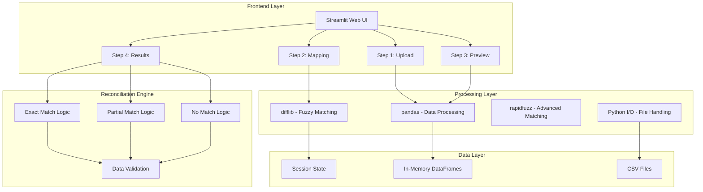

# hack2025

# **Automated Invoice and Payment Reconciliation for D365 Finance**

**Problem statement**:
Invoice/Payment reconciliation process is a critical financial control process where finance team compare company's internal records against statements or reports provided by vendors or customers to ensure all transactions are properly recorded and matched. It involves checking if issued/received invoices have been paid, and confirm any outstanding balances while resolving discrepancies. 

**Current challenges**
- This is a periodic task which is currently not supported in Dynamikcs 365 Finance
- Manual process taking 2-5 days per reconciliation cycle on averag
- High error rates due to human oversight
- Delayed identification of payment issues leading to vendor relationship strain
- Resource-intensive process requiring dedicated FTE allocation
- Limited real-time visibility into reconciliation status as the process takes such time

**Business value (based on research)**:
- Time savings: Reduce reconciliation time from 2-5 days to 2-4 hours
**ROI: 80-90% time reduction = $156,000 annual savings (assuming $65K FTE cost)**
- Error reduction: Decrease discrepancy rate from an average 3-5% to <0.5%
**ROI: Reduce write-offs and penalty fees by estimated $75,000 annually**
- Cash Flow Optimization: Faster identification of payment issues
**ROI: Improve cash flow by $500K+ through faster dispute resolution**
- Compliance Enhancement: Automated audit trails and documentation
**ROI: Reduce audit costs by 30-40% ($25,000 annual savings)**
- Vendor Relationship Improvement: Faster dispute resolution and payment processing
**ROI: Avoid early payment discount losses (~$50,000 annually)**
**Total Estimated Annual Value: $806,000+**

**Proces flow**:

*Accounts Payable (Vendor) Invoice/Payment Reconciliation Process*
1. Statement Preparation
- Receive vendor statements (weekly/monthly)
- Gather internal records: AP aging, payment records, invoice logs, settlement records
- Ensure consistent reporting periods for comparison

2. Invoice Matching
- Compare each invoice on vendor statement against AP records
- Verify invoice numbers, dates, and amounts match exactly
- Confirm partial payment status and open invoice balances
- Identify missing invoices in either system

3. Payment Verification
- Match payments shown on vendor statement against payment records
- Verify payment dates, amounts, and reference numbers
- Confirm payments are applied to correct invoices

4. Identifying Discrepancies (common issues to investigate):
- Timing differences: Payments in transit or invoices received after statement date
- Amount discrepancies: Different invoice amounts or partial payments
- Missing transactions: Items recorded by one party but not the other
- Duplicate entries: Same transaction recorded multiple times
- Misapplied payments: Payments credited to wrong invoices or accounts

5. Resolution Process
- Document all discrepancies in reconciliation worksheet
- Contact vendor to clarify differences
- Obtain supporting documentation (proof of payment, invoice copies)
- Make necessary adjusting entries in the system
- Request corrections from vendor if needed

6. Final Reconciliation
- Ensure both parties' records show same outstanding balance
- Document reconciliation process and retain supporting materials
- Update records with agreed-upon adjustments


**Presentation and Demo**:
https://microsofteur-my.sharepoint.com/:p:/g/personal/mibeinar_microsoft_com/ERNL_SSlSMhFi2PsHoFM6f8B0j7ReuDACEfJqdWLt86ABw?e=NoQDBj
https://microsofteur-my.sharepoint.com/:v:/g/personal/mibeinar_microsoft_com/EV8vMXN-BkJGnV3PA5K3khQBAUi3i-SjmPzOat21qHKADA?e=MhPqcc

# Architecture & Tech Spec

## Architecture Diagram



## Tech Stack

### Frontend
- **Streamlit** - Web UI framework
  - Interactive widgets (file upload, selectbox, tabs)
  - Session state management
  - Custom HTML/CSS styling
  - Real-time data display

### Backend Processing
- **pandas** - Data manipulation and analysis
  - CSV reading/writing
  - DataFrame operations
  - Data cleaning and validation
  - Aggregation and filtering

- **difflib** - Text similarity matching
  - Column name suggestions
  - Fuzzy string matching
  - Best match algorithms

- **rapidfuzz** - Advanced fuzzy matching
  - Performance-optimized matching
  - Multiple similarity algorithms

- **Python Standard Library**
  - `io` - In-memory file handling
  - `json` - Data serialization
  - `collections` - Data structures

## Data Flow

```
┌─────────────┐    ┌─────────────┐    ┌─────────────┐    ┌─────────────┐
│   Upload    │───▶│   Mapping   │───▶│   Preview   │───▶│   Results   │
│             │    │             │    │             │    │             │
│ • Validate  │    │ • Auto-map  │    │ • Clean     │    │ • Reconcile │
│ • Parse CSV │    │ • User edit │    │ • Display   │    │ • Export    │
│ • Store     │    │ • Suggest   │    │ • Validate  │    │ • Visualize │
└─────────────┘    └─────────────┘    └─────────────┘    └─────────────┘
```

## Core Features

### 1. Data Upload & Validation
- Multi-format CSV support
- Automatic delimiter detection
- Data cleaning and normalization
- Error handling and validation

### 2. Intelligent Column Mapping
- Auto-suggestion based on field names
- Fuzzy matching for similar columns
- Domain-specific mapping rules
- User-friendly mapping interface

### 3. Data Preview
- Side-by-side data comparison
- Mapped column highlighting
- Sample data display
- Validation feedback

### 4. Reconciliation Engine
- **Exact Match**: Perfect amount and ID matching
- **Partial Payment**: Balance-based matching
- **Amount Mismatch**: ID match but amount difference
- **No Match**: Unmatched invoices
- **Data Issues**: Invalid or missing data

### 5. Results & Export
- Summary statistics with color coding
- Interactive filtering by match type
- Detailed expandable cards
- Multiple CSV export formats

## Performance Characteristics

- **Memory Usage**: In-memory processing for files up to ~100MB
- **Processing Speed**: Real-time for datasets up to 10K records
- **Scalability**: Single-user sessions, no persistent storage
- **Browser Compatibility**: Modern browsers with JavaScript enabled

## Security & Privacy

- **Data Handling**: All processing in-memory, no persistent storage
- **File Security**: Temporary file handling, automatic cleanup
- **Session Isolation**: Per-user session state management
- **No External Dependencies**: Self-contained processing

## Getting Started

### Installation

1. **Install Python** (3.8 or higher)
2. **Install Required Dependencies**:
   ```bash
   pip install streamlit pandas rapidfuzz
   ```

### Running the Application

```bash
streamlit run invoice_payment_reconciliation.py
```

The application will open in your default web browser at `http://localhost:8501`

### Usage Workflow

1. **Step 1 - Upload**: Upload your invoice and payment CSV files
2. **Step 2 - Mapping**: Review and adjust the automatic column mappings
3. **Step 3 - Preview**: Verify the cleaned and mapped data
4. **Step 4 - Results**: View reconciliation results and download reports

## Deployment Options

### Local Development
```bash
pip install streamlit pandas rapidfuzz
streamlit run invoice_payment_reconciliation.py
```

### Production Deployment
- **Streamlit Cloud**: Direct GitHub integration
- **Docker**: Containerized deployment
- **Heroku**: Cloud platform deployment
- **AWS/Azure**: Enterprise cloud hosting

### Docker Deployment
```dockerfile
FROM python:3.9-slim

WORKDIR /app
COPY requirements.txt .
RUN pip install -r requirements.txt

COPY . .
EXPOSE 8501

CMD ["streamlit", "run", "invoice_payment_reconciliation.py", "--server.port=8501", "--server.address=0.0.0.0"]
```

## Requirements

### Python Dependencies
```
streamlit>=1.24.0
pandas>=2.0.0
rapidfuzz>=3.0.0
```

### System Requirements
- Python 3.8+
- 4GB RAM (recommended)
- Modern web browser
- Internet connection (for initial Streamlit setup)

## Contributing

1. Fork the repository
2. Create a feature branch
3. Make your changes
4. Test thoroughly
5. Submit a pull request

## License

This project is licensed under the MIT License - see the LICENSE file for details.

## Support

For questions or issues:
- Create an issue in the repository
- Contact the development team
- Check the documentation for common solutions

## Future Enhancements

- [ ] Move directly to D365 or Copilot Studio
- [ ] Database integration for persistent storage
- [ ] Multi-user support with authentication
- [ ] API endpoints for programmatic access
- [ ] Advanced matching algorithms (ML-based)
- [ ] Real-time collaboration features
- [ ] Audit trail and change tracking
- [ ] Integration with ERP systems (D365, SAP, etc.)
- [ ] Advanced reporting and analytics
- [ ] Mobile-responsive design
- [ ] Batch processing capabilities

**Prototyping and ideation**:
https://v0.app/chat/invoice-reconciliation-process-pcy1Dyo7b6J?f=1&b=b_rZq55nstKje
